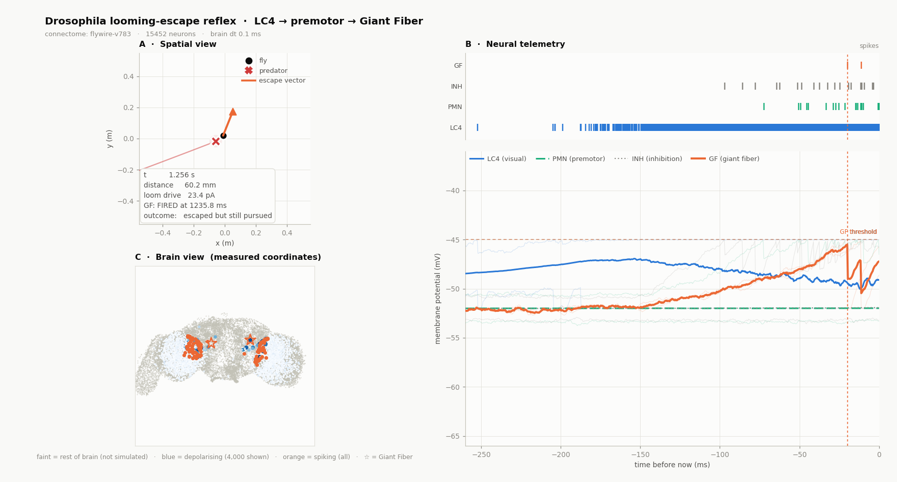

# Fly Simulator

A *Drosophila* neural-network simulator built to scale. The Starter Phase is a complete,
runnable 2D looming-escape reflex — LC4 visual neurons through a premotor pool to the
Giant Fiber — driven by a vectorized leaky integrate-and-fire engine, with a live
three-panel dashboard that shows the escape decision propagating through real brain
anatomy.

The architecture is cut so that the same LIF engine later drives a MuJoCo or Minecraft
body and reads a real ~140,000-neuron FlyWire connectome **without the engine changing**.

## Run it

```powershell
python main.py
```

That is the whole setup. NumPy and Matplotlib, nothing else — no API token, no download,
no data files. The connectome is a hardcoded 12×12 matrix.



## What you are looking at

**Panel A — Spatial view.** A fly at the origin; a predator closing at 0.42 m/s; a halo
around the predator whose opacity tracks the instantaneous looming drive. When the Giant
Fiber fires, an orange escape vector appears and the fly's trajectory kinks sharply away.

**Panel B — Neural telemetry.** A scrolling spike raster over scrolling membrane
potentials, aligned vertically so a spike sits directly above the voltage that produced
it. You watch LC4 (blue) begin firing, the premotor pool (aqua) follow ~50 ms later,
inhibition (grey) track alongside, and the Giant Fiber (orange) integrate until it crosses
its threshold and fires exactly once.

**Panel C — Brain view.** Every simulated neuron drawn where it physically sits, from
FlyWire's measured coordinates. The rest of the brain is greyed out behind it — those
neurons are *not* simulated. Watch the LC4 population light up bilaterally in the optic
lobes, then the two Giant Fibers flash between them. The mock circuits get a schematic
layout so this panel works with no download.

The escape vector in Panel A is the same colour as the GF trace in Panel B because they
are the same event.

## The escape threshold is emergent, not hardcoded

There is no `if distance < X: escape` anywhere in this codebase. The reflex works because
inhibition **saturates** and excitation does not: the inhibitory population is given a long
refractory period, capping its output near 125 Hz, while the premotor pool can climb past
400 Hz. At a slow approach, inhibition wins and the Giant Fiber sits below rest. As the
loom sharpens, excitation outruns inhibition and GF crosses threshold.

The consequence, measured rather than tuned:

```
escape triggers at an angular threat size of 24.6 degrees
```

which lands in the range reported for real *Drosophila* looming escapes — and a slow
approach produces no escape at all:

```powershell
python main.py --predator-speed 0.08     # GF never fires
python main.py --predator-speed 1.20     # GF fires early, at ~38 degrees
```

## Commands

```powershell
python main.py                                   # live dashboard
python main.py --check                           # headless acceptance test, exit code
python main.py --no-show                         # headless, prints a JSON summary
python main.py --save outputs/escape.mp4         # record (falls back to .gif if no ffmpeg)
python main.py --config configs/starter_2d.json  # partial config overrides

python main.py --connectome synthetic120         # 120-neuron population model
python main.py --connectome synthetic120 --seed 2
python main.py --connectome synthetic120 --lesion-lc4 0.4

python main.py --benchmark 50000                 # sparse-vs-dense, measured (needs SciPy)

python main.py --interactive                     # YOU are the threat: drive it with the mouse
python main.py --interactive --connectome flywire
python main.py --no-brain-view                   # drop panel C for a higher frame rate
python main.py --steps-per-frame 1               # 5x slow motion
python main.py --brain-dt 0.2                    # coarser timestep, ~2x faster
```

### Interactive mode

```powershell
python main.py --interactive
```

Move the mouse over the spatial panel to place the threat, scroll to resize it, `r` to
reset the fly. Things worth trying:

* **Creep in slowly, then flick fast from the same distance.** Same object, same position,
  opposite outcome — the circuit is measuring expansion rate, not proximity.
* **Scroll the object large and approach from far away.** It triggers at a much greater
  distance, because angular size is what matters.
* **Watch Panel B during a near miss.** You can catch the Giant Fiber ramping toward
  threshold and falling back without firing. That is the inhibition doing its job.

## The two connectomes, and why both exist

| | `mock12` (default) | `synthetic120` |
|---|---|---|
| Size | 6 LC4, 3 premotor, 2 inhibitory, 1 GF | 80 / 30 / 9 / 1 |
| Weights | hand-written literal you can read | seeded lognormal, sparse |
| Biophysics | hand-tuned per population | hand-tuned per population |
| Determinism | fully deterministic | varies with `--seed` |
| Shows | signal propagation, per-neuron traces | population coding, jitter, graded lesions |

Both are generated from **one shared rule table** (`flysim/brain/connectome.py`,
`TOTAL_INPUT_PA`) expressed as *total incoming picoamps per postsynaptic neuron*. Each
builder divides that total by its own fan-in. So the two models receive the same total
drive, and any behavioural difference between them comes from population structure rather
than an accidental rescaling.

What the population model gets you that 12 neurons cannot:

```powershell
# Trial-to-trial variability: a real reflex is not perfectly reliable.
python main.py --connectome synthetic120 --seed 0 --no-show   # escapes at 28.6 deg
python main.py --connectome synthetic120 --seed 1 --no-show   # escapes at 15.0 deg
python main.py --connectome synthetic120 --seed 2 --no-show   # caught

# Graded degradation: no single neuron is load-bearing.
python main.py --connectome synthetic120 --lesion-lc4 0.2 --no-show   # GF at 1316 ms
python main.py --connectome synthetic120 --lesion-lc4 0.4 --no-show   # GF at 1341 ms
python main.py --connectome synthetic120 --lesion-lc4 0.6 --no-show   # caught
```

Neither is a performance test — a 120×120 matmul is instant no matter how it is written.
`--benchmark` is the one that measures anything real:

```
connectome 'benchmark(n=50000)': 50000 neurons, 949824 edges (density 0.038%, sparse)
  sparse weights :        7.4 MiB (CSR, float32)
  dense would be :        9.3 GiB  <- why we do not do this
  ratio          :       1282x
```

## Architecture in one diagram

```
Environment --EnvObservation--> SensoryEncoder --SensoryPacket--> Brain
     ^                                                              |
     |                                                          BrainState
     +-------- MotorCommand <-- MotorDecoder <---------------------+
```

Four dataclasses are the only types that cross a boundary. The LIF engine never sees a
coordinate, a pixel, or a socket; the environment never sees a voltage. Enforced by import
rule, and checkable:

```powershell
python -c "from flysim.brain.lif import LIFBrain; import sys; print('matplotlib' in sys.modules)"
# False
```

Swapping the 2D arena for MuJoCo means writing one `BaseEnvironment` subclass. The proof
that this actually holds is `--connectome synthetic120`: a 10× larger network with
different connectivity statistics runs through the brain, runner, encoder, decoder and
dashboard with **zero source changes**.

## Documentation

| Document | Covers |
|---|---|
| [docs/COMPUTE_BUDGET.md](docs/COMPUTE_BUDGET.md) | Storage/RAM/GPU budgets, the 78 GB dense-matrix trap, directory layout, where the cache must live |
| [docs/CONNECTOME_ACCESS.md](docs/CONNECTOME_ACCESS.md) | NeuPrint and FlyWire tokens step by step, live queries, extracting LC4→DNp01, converting to `Connectome` |
| [docs/ARCHITECTURE.md](docs/ARCHITECTURE.md) | MuJoCo / Minecraft / socket integration, the timing problem, what still needs work |
| [CLAUDE.md](CLAUDE.md) | Contributor and agent rules: import boundaries, units, data-location policy |

## Going to real data

**The loader is built and tested.** No credential and no extra install is required — the
FlyWire Codex publishes each release as bulk CSVs, and pandas/pyarrow/scipy cover the rest.

```powershell
setx FLYSIM_CACHE_DIR "E:\FlyConnectome\cache"
# download connections.csv + classification.csv from codex.flywire.ai -> Downloads
# into E:\FlyConnectome\cache\flywire\v783\
python main.py --connectome flywire
```

Verified against a table with the real Codex schema:

```
  20,903 raw edges, 782 classified neurons
  seeds: 242 neurons matching ['DNP01', 'LC4', 'LPLC2']
  hop 1: 482 neurons
  built connectome: 482 neurons, 16,353 edges (GF=2, INH=106, LC4=240, PMN=134)
```

It then runs through the **unchanged** environment, encoder, LIF engine, decoder and
dashboard — the same claim `synthetic120` makes, now against real anatomy.

Real connectomes run the **published uniform LIF parameters** (Shiu et al., Nature 2024:
τ_m 20 ms, τ_syn 5 ms, threshold −45 mV, reset to rest) rather than the per-population
biophysics the mock circuit was tuned around. That matters: it means the escape threshold
comes from measured wiring plus published parameters, not from anything hand-fitted here.
It lands at **24.0°**, against the mock's 24.9°, which converged without being made to.

Useful flags: `--flywire-dir PATH`, `--flywire-version v783`, `--flywire-hops 2`.

The loader tolerates column-name drift between releases, caches CSV→Parquet on first load,
signs edges by the presynaptic neuron's transmitter, drops modulatory edges with a count,
and caps subnetwork expansion so one hop off a descending neuron cannot drag in the whole
brain. See [docs/CONNECTOME_ACCESS.md](docs/CONNECTOME_ACCESS.md) §5.

### Credentials (only needed for *live* queries, not for the above)

* **NeuPrint** — sign in at neuprint.janelia.org, Account → copy token. Minutes. Gives you
  hemibrain / MANC / male CNS.
* **FlyWire CAVE** — requires community registration and data-terms agreement before the
  token works; approval is a manual step. Start it early if you want live queries.

These are two different tokens and are not interchangeable.

**Cache location matters on this machine.** This repo lives inside OneDrive, which has
previously burned ~237,000 CPU-seconds syncing generated files. Put connectome caches on
`E:\` (336 GB free, not synced), never under the repo:

```powershell
setx FLYSIM_CACHE_DIR "E:\FlyConnectome\cache"
```

## Model scope — read this before citing anything

This is a **model**, and its simplifications are deliberate and labelled in the source:

* LC4 and LPLC2 synapse **directly** onto Giant Fiber dendrites in the real animal. The
  premotor relay stage here stands in for the convergent input population; it is a
  modelling choice, not anatomy.
* Weights, time constants and thresholds are plausible for fly central neurons but are not
  drawn from specific recordings.
* Gap junctions — which matter for the Giant Fiber specifically — are not modelled.
* The looming drive is an exponential proxy. The encoder also computes the ethologically
  correct `dθ/dt` and reports it in `SensoryPacket.raw`, so switching is one line.

Where the code departs from biology, the comment says so. Please keep that convention.
